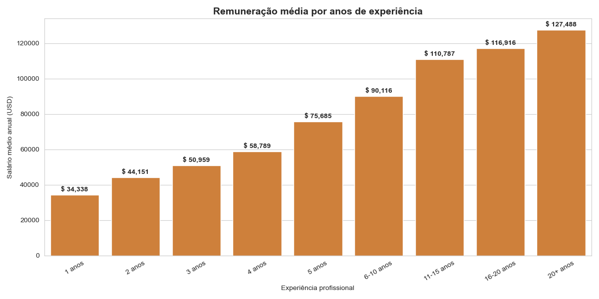
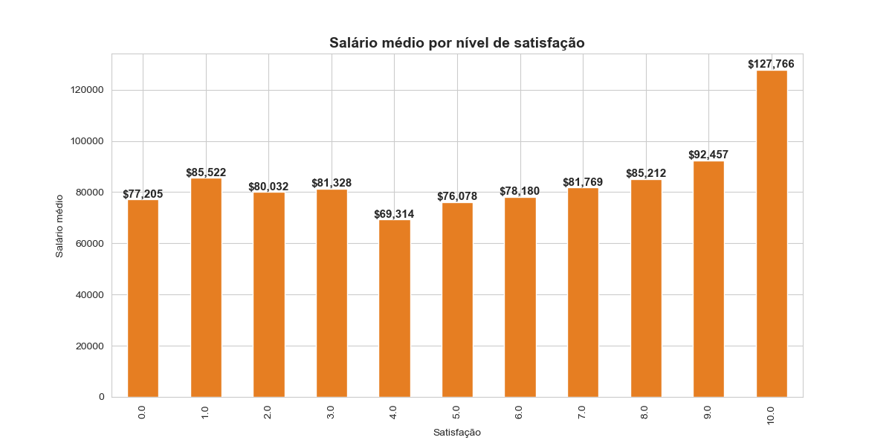
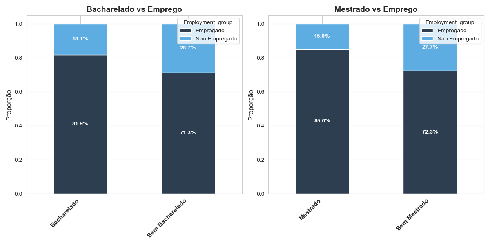

# 📊 Análise de Dados — Stack Overflow Developer Survey

## 📌 Objetivo
Este projeto tem como objetivo realizar uma análise exploratória de dados (EDA) utilizando o dataset do Stack Overflow Developer Survey, com foco em identificar padrões relacionados à remuneração, satisfação profissional e modelo de trabalho.

---

## 🛠️ Tecnologias utilizadas
- Python
- Pandas
- Matplotlib
- Seaborn
- Jupyter Notebook

---

## 📊 Análises realizadas

- Tratamento e limpeza de dados
- Análise da distribuição de experiência dos desenvolvedores
- Relação entre nível educacional e empregabilidade
- Comparação de salários por modelo de trabalho (remoto, híbrido e presencial)
- Avaliação da satisfação profissional por modelo de trabalho

---

## 💡 Principais insights

- Profissionais que trabalham de forma **remota apresentam maior média salarial**
- O modelo **híbrido mostra equilíbrio entre satisfação e remuneração**
- A **escolaridade não é um fator determinante** para estar empregado na área
- Existe uma concentração maior de desenvolvedores em níveis intermediários de experiência
- Quanto maior o tempo de experiência na área maior a probabilidade de haver crescimento na remuneração
- EUA é o país com a maior média de remuneração anual média
- Quem trabalha remotamente tende a ter uma maior satisfação no trabalho comparado a outros modelos

---

## 📊 Remuneração por Experiência Profissional
Profissionais com maior tempo de experiência apresentam aumento consistente na média salarial, evidenciando a valorização da senioridade no mercado.

---

## 📊 Remuneração por satisfação no trabalho
Níveis mais altos de satisfação estão associados a maiores salários, indicando possível correlação entre valorização profissional e bem-estar no trabalho.

---

## 🎓 Nível de escolaridade
A análise indica que a escolaridade não é um fator determinante absoluto para empregabilidade, com presença significativa de profissionais sem bacharelado atuando na área.

